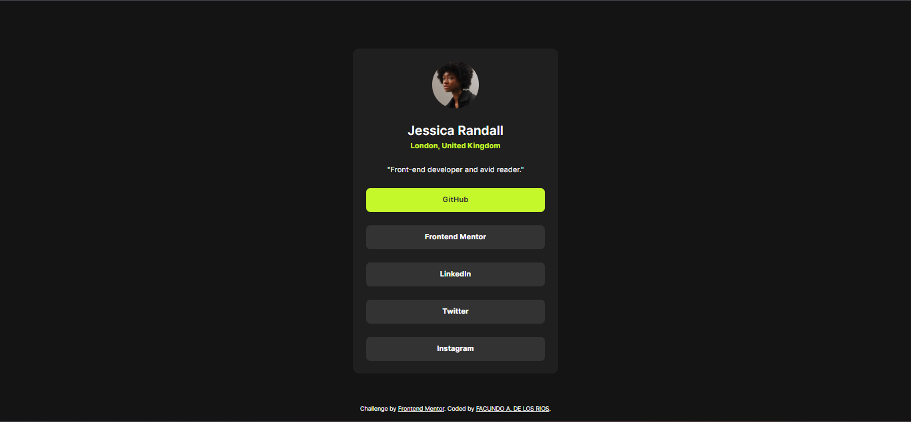
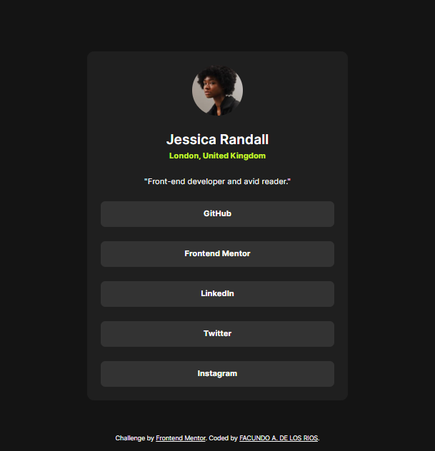

# Frontend Mentor - Blog preview card solution

This is a solution to the [Blog preview card challenge on Frontend Mentor](https://www.frontendmentor.io/challenges/social-links-profile-UG32l9m6dQ). Frontend Mentor challenges help you improve your coding skills by building realistic projects. 


## 📝 Table of contents

- [Overview](#overview)
  - [Screenshot](#screenshot)
  - [Links](#links)
- [My process](#my-process)
  - [Built with](#built-with)
  - [What I learned](#what-i-learned)
  - [Useful resources](#useful-resources)
- [Author](#author)

## Overview

### The challenge

Users should be able to:

- See hover and focus states for all interactive elements on the page

### 📸 Screenshot

**PC Screenshot**


**PC Hover effect Screenshot**



**Tablet Screenshot**



**Mobile Screenshot**


### 📎 Links

- Solution URL: [Github Repo](https://github.com/FacundoDLR/social-profile-card-newbie)
- Live Site URL: [Live Demo](https://social-profile-card-newbie.vercel.app/)

## My process

### Built with

- Semantic HTML5 markup 🧱
- CSS custom properties 🎨
- BEM Notation 🅱️
- Flexbox ⚒️
- Responsive Design
- SEO
- Mobile First
- NEW media query ranges syntax

### 🎓  What I learned

NEW media query syntax, SEO

```css
/* Sintaxis clasica */
@media screen and (max-width: 375px) {
  .element {
    /* La media query se aplica para resoluciones menores a 600px */
  }
}
/* Sintaxis de rango */
@media (width <= 375px) { ... }

/* Sintaxis clasica */
@media screen and (min-width: 375px) and (max-width: 768px) {
  .element {
    /* La media query se aplica para 
       resoluciones entre 375px y 768px */
  }
}
/* sintaxis de rango */
@media (375px <= width <= 768px) { ... }

/*  sintaxis clásica */
@media screen and (min-width: 768px) {
  .element {
    /* La media query se aplica para resoluciones mayores a 600px */
  }
}
/* Sintaxis de rango */
@media (width >= 768px) { ... }
```


### 💡 Useful resources

- [NEW media query syntax](https://dev.to/duxtech/media-queries-range-syntax-1o2l) - The new syntax of ranges for media querys generates a much cleaner and more understandable code at a glance, since compatibility with browsers is very high, I recommend becoming familiar with its use
- [METADATA & SEO](https://seowind.io/es/seo-meta-tags/) - Ignoring the importance of SEO meta tags can hurt your website's performance in search engines. Utilizing these essential components is crucial to achieving better ranking and visibility

## 🤩 Author

- GitHub - [FacundoDLR](https://github.com/FacundoDLR)
- Frontend Mentor - [@FacundoDLR](https://www.frontendmentor.io/profile/FacundoDLR)